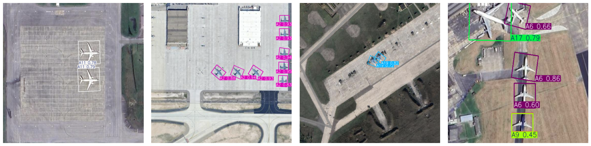

# Aircraft Recognition using YOLO-OBB

## Overview
This project focuses on detecting and classifying aircraft using the **YOLO Oriented Bounding Box (YOLO-OBB)** model. The dataset used for training and evaluation is the [Aircraft Recognition Dataset](https://www.kaggle.com/datasets/khlaifiabilel/military-aircraft-recognition-dataset).

## Features
- **Annotation Conversion**: Converts dataset annotations from XML format to YOLO-OBB format.
- **Dataset Preprocessing**: Splits the dataset into training and validation sets.
- **YOLO-OBB Model Training**: Fine-tunes YOLO for object detection with oriented bounding boxes.
- **Evaluation & Inference**: Validates model performance and runs inference on test images.


## Installation
### Prerequisites
Ensure you have the following installed:
- Python 3.9+
- Ultralytics YOLO (`ultralytics`)
- PyTorch (with CUDA for GPU acceleration)
- PIL (Pillow)
- Matplotlib
- lxml (for XML parsing)

### Install Dependencies
```bash
pip install ultralytics torch torchvision torchaudio matplotlib pillow lxml
```


## Dataset Preparation
### 1. Download Dataset
The dataset can be downloaded from [Kaggle](https://www.kaggle.com/datasets/khlaifiabilel/military-aircraft-recognition-dataset). Extract it to the `dataset/` directory.

### 2. Convert XML Annotations to YOLO-OBB Format
The annotation conversion is handled within the Jupyter Notebook.

### 3. Split Dataset
The dataset is split into training and validation sets within the notebook, organizing the files as follows:
```
dataset/Processed_dataset/
  ├── images/
  │   ├── train/
  │   └── val/
  ├── labels/
  │   ├── train/
  │   └── val/
```


## Training the YOLO-OBB Model
To train the model, run all cells in `YOLO11-OBB.ipynb`.

### Training Configuration
- **Model**: YOLO11n-OBB
- **Epochs**: 50
- **Batch Size**: 4
- **Image Size**: 1024


## Model Validation
After training, validate the model by running the respective cells in `YOLO11-OBB.ipynb`.


### Performance Metrics
| Class  | Images | Instances | Precision (P) | Recall (R) | mAP@50 | mAP@50-95 |
|--------|--------|-----------|--------------|------------|--------|------------|
| **All** | 769 | 4354 | **0.896** | **0.858** | **0.928** | **0.771** |
| A1  | 64 | 277 | 0.82 | 0.856 | 0.926 | 0.756 |
| A10 | 42 | 213 | 0.962 | 0.949 | 0.985 | 0.851 |
| A11 | 48 | 127 | 0.793 | 0.772 | 0.87  | 0.785 |
| A12 | 35 | 112 | 0.961 | 0.786 | 0.908 | 0.684 |
| A13 | 62 | 385 | 0.867 | 0.914 | 0.947 | 0.716 |
| A14 | 96 | 358 | 0.933 | 0.944 | 0.979 | 0.866 |
| A15 | 27 | 108 | 0.717 | 0.656 | 0.73  | 0.536 |
| A16 | 58 | 518 | 0.946 | 0.942 | 0.98  | 0.779 |
| A17 | 66 | 253 | 0.927 | 0.988 | 0.978 | 0.864 |
| A18 | 20 | 57  | 0.844 | 0.649 | 0.795 | 0.7   |
| A19 | 66 | 211 | 0.842 | 0.659 | 0.852 | 0.661 |
| A2  | 78 | 301 | 0.961 | 0.973 | 0.99  | 0.832 |
| A20 | 44 | 198 | 0.921 | 0.821 | 0.907 | 0.597 |


## Inference on New Images
Run inference on test images by executing the relevant cells in `YOLO11-OBB.ipynb`.


## Results & Performance
### Hardware Setup
- **GPU**: NVIDIA GeForce RTX 3050 Laptop GPU (4GB VRAM)
- **Training Time**: ~3 hours (50 epochs)
- **Average Inference Time**: 16ms per image

### Sample Detection Output



## Future Work
- Improve model performance with larger datasets.
- Experiment with different YOLO architectures.
- Implement real-time detection.

## License
This project is released under the MIT License.

